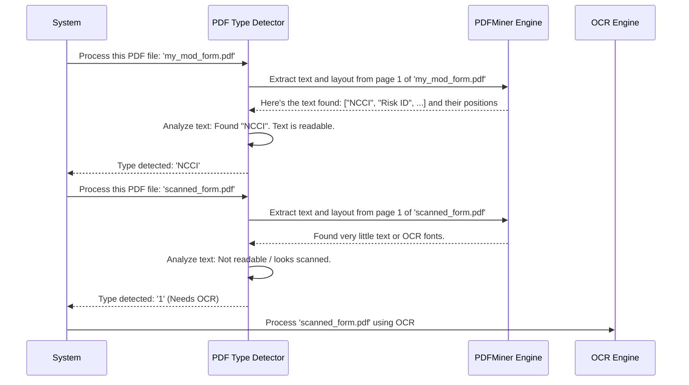

# Chapter 1: PDF Type Detector

Welcome to the `Backend-mod-api-php` tutorial! We're going to explore how this project processes PDF documents, specifically insurance forms like Experience Modification Rate (mod) worksheets. These documents contain valuable data, but extracting it automatically can be tricky because they come in many different formats.

## The Problem: So Many Different PDFs!

Imagine you receive dozens of mod worksheets every day. Some might be from NCCI (National Council on Compensation Insurance), others from specific states like California (CA) or Michigan (MI), and some might just be scanned images of paper forms. Each type looks different and has data arranged in its own unique way.

How can our system automatically understand which type of document it's looking at so it can extract the information correctly? Trying to use a single method for all of them would be like trying to use the same key for different locks – it just wouldn't work reliably.

## The Solution: The PDF Type Detector - Our Gatekeeper

This is where the **PDF Type Detector** comes in. Think of it as the project's initial gatekeeper or a super-smart sorting office for PDFs. Its main job is to look at a newly arrived PDF and figure out what kind it is.

*   **Is it an NCCI form?**
*   **Is it a California (CA) form?**
*   **Is it a Michigan (MI) form?**
*   **Is it a New York (NY) form?**
*   **Or... is it just a picture of a form (a scanned image)?**

It does this by quickly analyzing the text and layout of the *first page* of the PDF. It looks for tell-tale signs – specific words, phrases, or how things are positioned on the page.

If the Detector recognizes the format (like NCCI or CA), it tells the system, "Okay, this is an NCCI document. Send it to the NCCI processor."

If the Detector finds that it *can't read the text* directly (maybe the PDF is just an image, like a photo or a scan), it flags it and says, "This looks like a scanned image. We'll need to use Optical Character Recognition (OCR) to read it first." We'll learn more about OCR later in the [OCR Parser Engine](04_ocr_parser_engine_.md) chapter.

## Why is Identifying the Type So Important?

Knowing the PDF type right at the beginning is crucial. Why? Because different forms need different rules to extract data accurately. An NCCI form has data in different places compared to a California form. By identifying the type first, we ensure the PDF gets sent to the correct specialized tool – the [State/Format Specific Parser](02_state_format_specific_parser_.md) – which knows exactly where to find the information for *that specific type* of document.

## How Does It Work? A Peek Inside

The PDF Type Detector relies heavily on a Python script (`pdf_type_detector.py`) and a powerful library called `pdfminer.six` (which we'll explore more in the [PDFMiner Parser Engine](03_pdfminer_parser_engine_.md) chapter) to peek inside the PDF.

Here's a simplified step-by-step:

1.  **Open the PDF:** The detector gets the path to the PDF file.
2.  **Try Reading Text:** It uses `pdfminer.six` to extract text elements and their positions (X, Y coordinates) from the first page.
3.  **Collect Clues:** The extracted text lines are stored, including the words and their locations.
4.  **Hunt for Keywords:** The detector scans the extracted text for specific keywords that act as markers. For example:
    *   Does it see "NCCI" near the top? Likely an NCCI form.
    *   Does it see "California" or "WCIRB"? Likely a CA form.
    *   Does it see "Michigan"? Likely an MI form.
    *   Does it see "NYCIRB"? Likely an NY form.
5.  **Check Text Readability:** It also checks *if* text could be extracted properly. If it gets very little text, gibberish (like `(cid:...)`), or text with fonts often used by OCR software *after* scanning, it suspects the PDF is an image or needs OCR.
6.  **Make a Decision:**
    *   If strong keywords are found and the text is readable, it returns the identified type (e.g., "NCCI", "CA", "MI", "NY").
    *   If the text seems unreadable or looks like a scan, it returns a special code (like '1' or '2') telling the system that OCR processing is required via the [OCR Parser Engine](04_ocr_parser_engine_.md).
    *   If it's readable text but doesn't match any known type, it might default to a specific type or also trigger OCR as a fallback.

Let's visualize this flow:



## Code Snippets: Seeing the Logic

The core logic resides in the `pdf_type_detector.py` script. Let's look at a *simplified* idea of how it identifies the type based on keywords found in the extracted text (`ListOfStrings` contains items like `[[X, Y, Width, Height], 'text', 'font', size]`).

```python
# (Inside pdf_type_detector.py - simplified logic)
def parse_pdf(file_name, start_page, end_page):
    # ... (code to open PDF and extract text into ListOfStrings) ...
    # ListOfStrings contains text elements like:
    # [[100, 700, 150, 710], 'ncci experience rating worksheet', 'fontA', 10]
    # [[450, 700, 500, 710], 'risk id:', 'fontB', 9]

    type_pdf = 'undefined' # Default type
    ocr_detected = False # Assume it's not a scan initially

    # --- Text Extraction using PDFMiner happens here ---
    # If extraction fails or text looks weird, set ocr_detected = True

    if not ocr_detected and ListOfStrings: # If we got readable text
        # Check for keywords in the extracted text
        all_text_page_1 = ''.join([item[1] for item in ListOfStrings])

        if 'ncci' in all_text_page_1 and 'risk id' in all_text_page_1:
            type_pdf = 'NCCI'
        elif 'california' in all_text_page_1 or 'wcirb' in all_text_page_1:
            type_pdf = 'CA'
        elif 'michigan' in all_text_page_1:
            type_pdf = 'MI'
        elif 'nycirb' in all_text_page_1:
            type_pdf = 'NY'
        # ... other checks for WI, PA, NC etc. ...

    # --- Decision time ---
    if ocr_detected:
        # Return '1' or '2' to signal need for different OCR methods
        return '1' # Example: Needs basic OCR
    elif type_pdf != 'undefined':
        return type_pdf # Return the identified type (e.g., 'NCCI')
    else:
        # Readable text, but didn't match known types. Maybe try OCR?
        return '1' # Fallback: Treat as potentially scanned
```

This simplified snippet shows the core idea:
1.  Try to extract text using the [PDFMiner Parser Engine](03_pdfminer_parser_engine_.md).
2.  Check if the extraction worked (`ocr_detected`).
3.  If text is good, search for keywords (`'ncci'`, `'california'`, etc.).
4.  Return the identified type or a code indicating OCR is needed.

The actual code (`pdf_type_detector.py`) has more sophisticated checks, including looking at text positions and specific font names sometimes embedded by scanners, but the fundamental principle is this keyword and readability analysis. It also distinguishes between two types of OCR needed ('1' for photo-like scans, '2' for PDFs with weird symbols where text should be).

## Conclusion

The PDF Type Detector acts as the essential first step in the document processing pipeline. It quickly analyzes an incoming PDF, determines its format (NCCI, CA, MI, NY, etc.) or identifies if it's a scanned image requiring OCR. This classification allows the system to route the PDF to the correct specialized tool for accurate data extraction.

Now that we know how the system identifies the *type* of PDF, what happens next? The PDF is handed off to a parser specifically designed for that type. Let's explore that in the next chapter!

**Next:** [Chapter 2: State/Format Specific Parser](02_state_format_specific_parser_.md)

---

