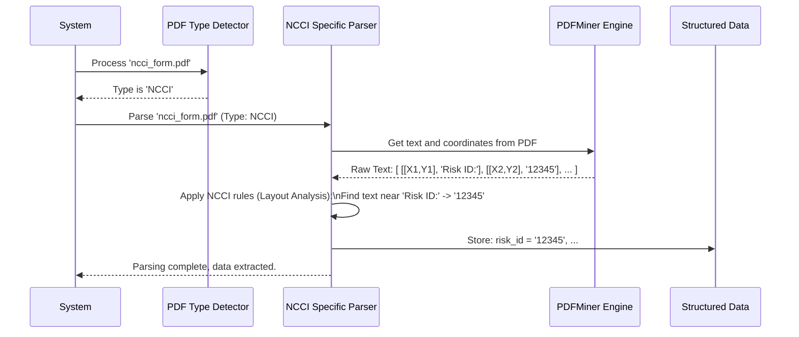

# Chapter 2: State/Format Specific Parser

Welcome back! In [Chapter 1: PDF Type Detector](01_pdf_type_detector_.md), we learned how the system cleverly identifies the *type* of PDF form it receives (like NCCI, CA, MI, or a scanned image). Think of it as a sorting office that labels each package (PDF) with its destination.

Now, what happens after a package is labeled? It gets sent to the specialist who knows exactly how to handle *that specific type* of package. That's where the **State/Format Specific Parser** comes in!

## The Problem: One Size Doesn't Fit All

Imagine you have instruction manuals for building different pieces of furniture – a chair, a table, a bookshelf. Each manual is specific to its item. You wouldn't use the chair instructions to build the bookshelf, right?

Similarly, PDF mod worksheets from different states (like California - CA) or sources (like NCCI) have their data arranged in completely different ways. A "Risk ID" might be at the top-right on an NCCI form but somewhere else entirely on a CA form. Using one single method to extract data from all these different layouts would lead to chaos and incorrect information.

## The Solution: Specialized Translators for Each Format

Once the [PDF Type Detector](01_pdf_type_detector_.md) tells us, "Hey, this is a California (CA) form!", the system hands the PDF over to the **CA Specific Parser**. If it identifies an NCCI form, it goes to the **NCCI Specific Parser**.

Think of these State/Format Specific Parsers as **specialized translators**. Each one is fluent in the unique "layout language" of *one particular type* of document (e.g., CA, NCCI, MI, NY, PA, WI, MN, or even specific software outputs like ModMaster).

Key points about these parsers:

1.  **Dedicated:** There's a separate parser script (or logic block) for each known PDF format.
2.  **Layout Experts:** Each parser contains custom **Layout Analysis** logic. This means it knows the *exact coordinates* (like X, Y positions on the page) or *specific keywords* to look for to find data fields like "Risk ID", "Effective Date", "Payroll", or "Losses" for *its specific format*.
3.  **Engine Choice:** Based on the initial check by the [PDF Type Detector](01_pdf_type_detector_.md), the specific parser knows whether to use the [PDFMiner Parser Engine](03_pdfminer_parser_engine_.md) (to read text directly from the PDF) or the [OCR Parser Engine](04_ocr_parser_engine_.md) (to read text from a scanned image).

## How Does It Work? A Look Inside

Let's follow a PDF through this stage:

1.  **Input:** The specific parser receives the path to the PDF file and the type identified in Chapter 1 (e.g., 'NCCI', 'CA', 'MI', or an OCR code like '1' or '2').
2.  **Engine Selection:**
    *   If the type is 'NCCI', 'CA', etc. (meaning it's likely text-readable), the parser primarily uses the [PDFMiner Parser Engine](03_pdfminer_parser_engine_.md) to get text elements and their coordinates.
    *   If the type indicates OCR is needed ('1' or '2'), the parser uses the [OCR Parser Engine](04_ocr_parser_engine_.md) to get text and coordinates from the image representation of the PDF.
3.  **Layout Analysis:** The parser now applies its *unique set of rules*. These rules are specific to the document type it handles. It might look for:
    *   Text at **specific coordinates**: "Find the text around X=500, Y=700 – that should be the Risk ID."
    *   Text **near specific keywords**: "Find the text immediately *after* the word 'Carrier:' – that's the carrier name."
    *   Data within **table structures** identified by header keywords or lines.
4.  **Data Extraction:** Using these rules, the parser pulls out the relevant pieces of information (like names, dates, numbers). We'll explore this more in [Data Extraction & Transformation](06_data_extraction___transformation_.md).
5.  **Output:** The parser organizes the extracted data into a structured format (like a Python dictionary or list), ready for the final step of creating the JSON output ([JSON Output Formatter](07_json_output_formatter_.md)).

Let's visualize this with an example for an NCCI form:



## Code Examples: Peeking at the Specialists

We have several Python scripts acting as these specialized parsers. For example:

*   `pdf_parser.py` (handles older NCCI format using PDFMiner)
*   `pdf_parser_ncci2.py` (handles newer NCCI format using PDFMiner)
*   `pdf_parser_ca.py` (handles California format using PDFMiner)
*   `pdf_parser_ny.py` / `pdf_parser_ny2.py` (handle New York formats using PDFMiner)
*   `pdf_parser_mi.py` / `pdf_parser_mi2.py` (handle Michigan formats using PDFMiner)
*   `pdf_parser_pa.py` (handles Pennsylvania format using PDFMiner)
*   `pdf_parser_wi.py` / `pdf_parser_wi2.py` (handle Wisconsin formats using PDFMiner)
*   `pdf_parser_mn.py` (handles Minnesota format using PDFMiner)
*   `pdf_parser_nc.py` (handles North Carolina format using PDFMiner)
*   `ocrCA.py`, `ocrNC.py`, `ocrMI.py`, `ocrNCCI.py`, `ocrMN.py` (handle scanned versions of these formats using OCR)

Let's look at *simplified* snippets to understand their core logic.

**Example 1: PDFMiner-based Parser (Simplified from `pdf_parser.py` for NCCI)**

This parser uses text coordinates extracted by the [PDFMiner Parser Engine](03_pdfminer_parser_engine_.md).

```python
# (Inside a specific parser like pdf_parser.py - simplified logic)
# 'finals' is a list of text elements: [[X, Y], 'Text', 'Font'] sorted by position

risk_id = "Not Found"
rating_effective_date = "Not Found"

# Iterate through text elements found on the page
for element in finals:
    x_coord = element[0][0]
    y_coord = element[0][1]
    text = element[1]

    # Rule 1: Find Risk ID based on coordinates (Example coordinates)
    if 480 < x_coord < 520 and 730 < y_coord < 745:
        risk_id = text.strip() # Found it!

    # Rule 2: Find Rating Date based on coordinates (Example coordinates)
    if 197 < x_coord < 202 and 710 < y_coord < 725:
        rating_effective_date = text.strip() # Found it!

# ... many more rules for other fields ...

# Store the extracted data
extracted_data = {
    "risk_id": risk_id,
    "rating_effective_date": rating_effective_date,
    # ... other data ...
}
```

*   **Explanation:** This code loops through the text pieces found by PDFMiner. It uses specific `if` conditions with hardcoded X and Y coordinates (like `480 < x_coord < 520`) to identify where specific data fields *should* be located in *this particular* (e.g., NCCI) form layout.

**Example 2: OCR-based Parser (Simplified from `ocrCA.py` for California)**

This parser uses text and coordinates extracted by the [OCR Parser Engine](04_ocr_parser_engine_.md).

```python
# (Inside an OCR parser like ocrCA.py - simplified logic)
# 'cords' = list of coordinates for each word [[x1,y1], [x2,y2], ...]
# 'detected_word' = list of words found by OCR ["Bureau", "No.", "12345", ...]
# 'LIST' combines these: list of [coordinates, word]

risk_id = "Not Found"
rating_effective_date = "Not Found"

# Rule 1: Find the coordinates of the keyword "Bureau"
bureau_cord = None
for coords, word in LIST:
    if "bureau" in word.lower():
        bureau_cord = coords # Found the keyword location
        break

# Rule 2: Look for text in a specific area RELATIVE to "Bureau"
if bureau_cord:
    # Define an area relative to bureau_cord where Risk ID should be
    risk_id_area = [ [bureau_cord[0][0]+100, bureau_cord[0][1]-10], # Top-Left
                     [bureau_cord[0][0]+250, bureau_cord[3][1]+10] ] # Bottom-Right

    # Search for words inside that calculated area
    for coords, word in LIST:
        if blockIsIn(coords, risk_id_area): # Function checks if coords are inside area
             risk_id += word # Found Risk ID part

# ... similar logic using keywords like "effective" to find the date ...

# Store the extracted data
extracted_data = {
    "risk_id": risk_id.strip(),
    "rating_effective_date": rating_effective_date,
    # ... other data ...
}
```

*   **Explanation:** This OCR parser first finds a known keyword ("bureau"). Then, based on where that keyword was found, it defines a rectangular area `risk_id_area` where the actual Risk ID number is expected to be on *this specific* (e.g., CA) form. It then searches the OCR results for any text falling within that calculated area.

These examples show how each parser uses its *specific knowledge* of the document's layout (coordinates, keywords, relative positions) to translate the raw text data into meaningful information.

## Conclusion

The State/Format Specific Parser is the workhorse that handles the unique structure of each document type identified by the [PDF Type Detector](01_pdf_type_detector_.md). Like specialized translators or assembly experts, each parser knows exactly how to read and interpret *its* specific format, using either direct text extraction or OCR. It applies tailored layout rules to find and extract the necessary data fields accurately.

Now that we understand how the system chooses a specialist and how that specialist works, let's dive deeper into the tools they use. First, we'll explore the engine used for reading text directly from PDFs.

**Next:** [Chapter 3: PDFMiner Parser Engine](03_pdfminer_parser_engine_.md)

---
