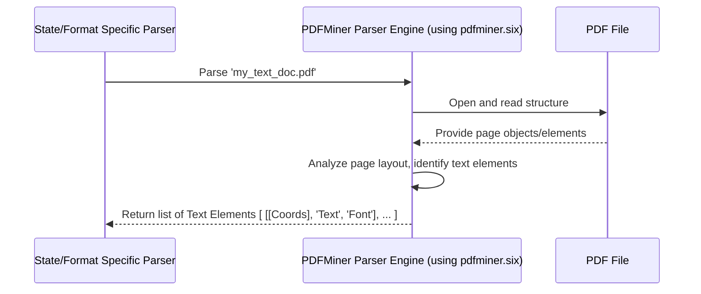

# Chapter 3: PDFMiner Parser Engine

In [Chapter 2: State/Format Specific Parser](02_state_format_specific_parser_.md), we learned how the system uses specialized parsers for different document types (like NCCI, CA, etc.). We also saw that these parsers need a way to actually *read* the content from the PDF file.

But how does the parser read a PDF, especially one where you can select the text like in a regular document? That's where our first engine comes in: the **PDFMiner Parser Engine**.

## The Problem: Reading Text Inside a PDF

Imagine you have a PDF document, like an NCCI mod worksheet. You open it on your computer, and you can highlight and copy the text. This means the text isn't just a picture; it's actually stored *as text* inside the PDF file.

Our program needs a way to read this text accurately. More importantly, it needs to know *exactly where* each piece of text is located on the page (its coordinates) so the [State/Format Specific Parser](02_state_format_specific_parser_.md) can find specific data fields like "Risk ID" or "Effective Date".

## The Solution: PDFMiner - The Precise Librarian

Think of the **PDFMiner Parser Engine** as a meticulous librarian dealing with a perfectly printed book (our text-based PDF). This librarian doesn't just read the words; they carefully note down:

1.  **The exact text:** "Risk ID:", "12345", "Effective Date:", "01/01/2023"
2.  **The precise location:** Where on the page (using X and Y coordinates) each piece of text appears.
3.  **Extra details (sometimes):** Like the font used for the text.

This engine uses a powerful Python library called `pdfminer.six` to perform this task. It dives into the internal structure of the PDF file and extracts all the text elements along with their positional information.

**Key Function:** To extract text and its coordinates (X, Y) from PDFs where text is directly embedded (not just an image).

**Limitation:** It only works if the PDF contains actual text data. If the PDF is just a scanned image or a photo of a document, PDFMiner won't find any text to extract (like asking the librarian to read a book with blank pages). For those cases, we'll need a different tool, the [OCR Parser Engine](04_ocr_parser_engine_.md).

## How It's Used

Remember from Chapter 2, the [State/Format Specific Parser](02_state_format_specific_parser_.md) gets called after the [PDF Type Detector](01_pdf_type_detector_.md) identifies the document type. If the detector determined the PDF is text-based (like 'NCCI', 'CA', 'NY', etc., and not flagged for OCR), the specific parser will rely on the PDFMiner Parser Engine.

1.  **Request:** The NCCI Parser (for example) asks the PDFMiner Engine: "Please read this NCCI PDF file and give me all the text elements and their positions."
2.  **Processing:** The PDFMiner Engine uses `pdfminer.six` to analyze the PDF.
3.  **Response:** It returns a detailed list of text elements found on each page. This list might look something like this (simplified):

    ```
    [
      # [ [X_start, Y_bottom, X_end, Y_top], 'Text Content', 'Font Name', FontSize ],
      [ [55, 710, 150, 720], 'NCCI Experience Rating Worksheet', 'Arial-BoldMT', 12 ],
      [ [450, 710, 500, 720], 'Risk ID:', 'ArialMT', 10 ],
      [ [505, 710, 550, 720], '1234567', 'ArialMT', 10 ],
      [ [55, 690, 150, 700], 'Effective Date:', 'ArialMT', 10 ],
      [ [155, 690, 220, 700], '01/01/2024', 'ArialMT', 10 ],
      # ... and many more elements
    ]
    ```
4.  **Usage:** The NCCI Parser then uses this precise list and its layout rules (coordinates, keywords) to find and extract the data it needs (as we saw in Chapter 2).

## Inside the Engine: A Peek at the Code

The core logic for using PDFMiner resides within the various `pdf_parser*.py` scripts (like `pdf_parser.py`, `pdf_parser_ncci2.py`, `pdf_parser_ca.py`, etc.). They all use the `pdfminer.six` library.

Let's look at a simplified conceptual flow:



Now, let's see a *highly simplified* example of how the code might extract these elements, inspired by the `parse_obj` function found in scripts like `pdf_parser.py`.

```python
# Simplified snippet inspired by pdf_parser.py

from pdfminer.layout import LTTextLine, LTTextBoxHorizontal, LTFigure
# ... other pdfminer imports ...

# List to store extracted elements
ListOfStrings = []

# This function processes PDF layout objects recursively
def simplified_parse_obj(layout_objects):
    for obj in layout_objects:
        # Is this object a line of text?
        if isinstance(obj, LTTextLine):
            # Get bounding box [X_start, Y_bottom, X_end, Y_top]
            coords = obj.bbox
            # Get the actual text content
            text = obj.get_text().replace('\n', ' ').strip()
            # (Optional: Get font info)
            font_info = [x for x in obj][0].fontname
            # Add to our list
            if text: # Only add if there's actual text
                 ListOfStrings.append([coords, text, font_info])

        # If it's a container, look inside it for text
        elif isinstance(obj, LTTextBoxHorizontal):
            simplified_parse_obj(obj._objs) # Recursive call
        elif isinstance(obj, LTFigure):
             simplified_parse_obj(obj._objs) # Recursive call
        # (Actual code handles more object types)

# --- Somewhere else in the parser script ---
# ... (code to open PDF and get page layout) ...
# layout = device.get_result() # Get page layout objects

# Start parsing the objects on the page
# simplified_parse_obj(layout._objs)

# Now 'ListOfStrings' contains the text elements with coordinates
# print(ListOfStrings)
# Output might look like:
# [ [[55, 710, ...], 'NCCI Experience Rating Worksheet', 'Arial-BoldMT'], ...]
```

**Explanation:**

1.  We import necessary classes from `pdfminer.layout`.
2.  The `simplified_parse_obj` function takes PDF objects found on a page.
3.  It loops through each `obj`.
4.  If an object is an `LTTextLine` (a line of text), it grabs its coordinates (`obj.bbox`) and the text content (`obj.get_text()`), cleans it up, and adds it to our `ListOfStrings`.
5.  If the object is a container like `LTTextBoxHorizontal` (a box potentially containing multiple lines) or `LTFigure`, it calls itself (`simplified_parse_obj`) to look inside that container. This is called recursion.
6.  After running this on the page layout, `ListOfStrings` holds the structured text data needed by the [State/Format Specific Parser](02_state_format_specific_parser_.md).

The actual code in the project is more complex, handling various PDF quirks, different page coordinate systems, and sorting the results, but the core principle is using `pdfminer.six` to iterate through page objects and extract text with its precise location.

## Conclusion

The PDFMiner Parser Engine is the project's tool for reading PDFs that contain *actual text*. It acts like a precise librarian, using the `pdfminer.six` library to extract not just the words but also their exact coordinates (X, Y) on the page. This detailed information is essential for the [State/Format Specific Parser](02_state_format_specific_parser_.md) to accurately locate and extract data based on the document's specific layout.

However, what happens when the PDF is just an image, like a scan? PDFMiner can't read pictures of text. For that, we need a different kind of engine.

**Next:** [Chapter 4: OCR Parser Engine](04_ocr_parser_engine_.md)

---

