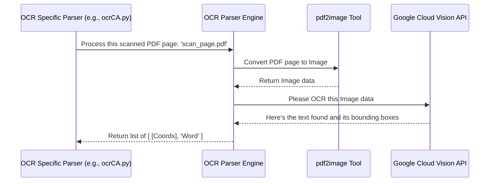

# Chapter 4: OCR Parser Engine

In the [previous chapter](03_pdfminer_parser_engine_.md), we learned about the [PDFMiner Parser Engine](03_pdfminer_parser_engine_.md), our tool for reading PDFs where the text is already stored like in a normal document. It's great when we can just select and copy the text directly from the PDF.

But what happens when the PDF isn't like that?

## The Problem: My PDF is Just a Picture!

Imagine someone scans a paper mod worksheet or takes a photo of it and saves it as a PDF. When you open this PDF, you can't select the text. It's basically just an image wrapped inside a PDF file.

Our [PDFMiner Parser Engine](03_pdfminer_parser_engine_.md) can't read text from an image. It's like asking it to read a book where all the pages are photographs – it only understands actual typed characters, not pictures of characters.

How can our system read the "Risk ID" or "Effective Date" from these scanned or image-based PDFs?

## The Solution: The OCR Parser Engine - Our Image Reader

This is where the **OCR Parser Engine** steps in! OCR stands for **Optical Character Recognition**.

Think of this engine like a super-smart app on your phone. You take a picture of a page from a book or a sign, and the app magically recognizes the text in the picture, allowing you to copy or search it.

The OCR Parser Engine does something very similar for our PDF documents:

1.  **Sees the Image:** It takes the PDF page, which is essentially an image.
2.  **Recognizes Characters:** It analyzes the image to identify shapes that look like letters and numbers.
3.  **Reads the Text:** It converts those recognized shapes back into actual text characters that the computer can understand.
4.  **Notes the Location:** Just like PDFMiner, it also figures out *where* on the page each piece of recognized text is located (its bounding box or coordinates).

This engine is specifically designed to handle PDFs that the [PDF Type Detector](01_pdf_type_detector_.md) identified as needing OCR (often flagged with a code like '1' or '2').

## How Does It Work? The Steps

The OCR Parser Engine uses a combination of tools to achieve this "image reading":

1.  **PDF to Image:** First, it needs to get the actual image out of the PDF page. It uses a tool called `pdf2image` to convert each page of the PDF into an image file (like a TIFF or PNG).
2.  **Image Cleanup (Optional):** Sometimes, scanned images are messy (skewed, dark, noisy). The engine *might* use image processing libraries like OpenCV (`cv2`), NumPy (`numpy`), or Pillow (`PIL`) to clean up the image or isolate specific parts before trying to read it. This helps improve the accuracy of the text recognition. (This cleanup is often done within the specific OCR parser scripts like `ocrCA.py`).
3.  **Send to the Expert (Google Cloud Vision):** The core of the OCR process happens here. The engine takes the prepared image and sends it to a powerful cloud service from Google called **Google Cloud Vision API** (`vision_v1`). This service is highly specialized in analyzing images, including reading text.
4.  **Get the Results:** Google Cloud Vision analyzes the image and sends back the text it found, along with the coordinates (bounding boxes) for each word or character.

## How It's Used in the Project

Let's follow the journey of a scanned PDF:

1.  **Detection:** The [PDF Type Detector](01_pdf_type_detector_.md) looks at `scanned_form.pdf` and realizes it can't read the text directly. It tells the system, "This needs OCR (Type '1')".
2.  **Routing:** The system sends the PDF to the appropriate [State/Format Specific Parser](02_state_format_specific_parser_.md) that handles OCR for that type (e.g., `ocrCA.py` if it might be a scanned California form).
3.  **Request:** The `ocrCA.py` parser knows it needs OCR. It asks the **OCR Parser Engine**: "Please read the text from this scanned PDF page."
4.  **Processing (OCR Engine):**
    *   Converts the PDF page to an image using `pdf2image`.
    *   (Optionally cleans the image using `cv2`/`PIL`).
    *   Sends the image to Google Cloud Vision API.
    *   Receives the detected text and coordinates.
5.  **Response:** The OCR Engine returns a list of detected words and their locations to the `ocrCA.py` parser. This list might look something like this (simplified):

    ```
    [
      # [ [[X1,Y1],[X2,Y2],[X3,Y3],[X4,Y4]], 'DetectedWord' ],
      [ [[50, 700], [150, 700], [150, 715], [50, 715]], 'Bureau' ],
      [ [[160, 700], [190, 700], [190, 715], [160, 715]], 'No.' ],
      [ [[200, 700], [260, 700], [260, 715], [200, 715]], '123456' ],
      # ... and many more words
    ]
    ```
    *(Each word has 4 corner points defining its bounding box.)*
6.  **Usage:** The `ocrCA.py` parser then uses this list and its specific layout rules (like finding text *near* the word "Bureau") to extract the required data fields, just like we saw in [Chapter 2](02_state_format_specific_parser_.md).

## Inside the Engine: A Peek Under the Hood

Let's visualize the process when a specific OCR parser script (like `ocrCA.py`) uses the OCR Engine:



Now, let's look at *simplified* code concepts inspired by the OCR scripts (`ocrCA.py`, `ocrNC.py`, etc.).

**Step 1: Converting PDF Page to Image (using `pdf2image`)**

```python
# Simplified concept using pdf2image
from pdf2image import convert_from_path
import numpy as np

# Get the path to the PDF
pdf_path = 'scanned_form.pdf'
page_number_to_convert = 1 # Example: process the first page

# Convert the specific page to an image object (using Pillow - PIL)
images = convert_from_path(pdf_path, first_page=page_number_to_convert, last_page=page_number_to_convert)
image_page_1 = images[0] # Get the image for the first page

# Convert the image to a format OpenCV (cv2) or Google Vision can use
image_np = np.array(image_page_1)

# 'image_np' now holds the pixel data for the page image
```

*   **Explanation:** This code uses the `convert_from_path` function from the `pdf2image` library to turn page 1 of our PDF into an image. We then convert it into a format (`numpy` array) that other image tools can work with.

**Step 2: Detecting Text with Google Cloud Vision (Simplified `detect` function)**

```python
# Simplified concept using google.cloud.vision_v1
from google.cloud import vision_v1
import io

# Assume 'image_np' contains the image data from the previous step
# Need to encode the image (e.g., as TIFF or PNG)
# (Code to encode 'image_np' into 'image_content' bytes goes here)
# For example, using OpenCV:
# _, encoded_image = cv2.imencode('.tiff', image_np)
# image_content = encoded_image.tobytes()

# --- Pretend we have 'image_content' ---
image_content = b'...' # Placeholder for actual image bytes

# Prepare the request for Google Cloud Vision
client = vision_v1.ImageAnnotatorClient()
image = vision_v1.Image(content=image_content)
feature = vision_v1.Feature(type_=vision_v1.Feature.Type.DOCUMENT_TEXT_DETECTION)
request = vision_v1.AnnotateImageRequest(image=image, features=[feature])

# Send the request and get the response
response = client.annotate_image(request=request)

# Process the response (Simplified)
detected_words = []
word_coordinates = []
# (Loop through response.full_text_annotation.pages...blocks...paragraphs...words)
for word in response.full_text_annotation.pages[0].blocks[0].paragraphs[0].words:
    text = ''.join([symbol.text for symbol in word.symbols])
    coords = [[v.x, v.y] for v in word.bounding_box.vertices]
    detected_words.append(text)
    word_coordinates.append(coords)

# Now 'detected_words' and 'word_coordinates' hold the OCR results
# print(list(zip(word_coordinates, detected_words)))
# Output might look like:
# [ ([ [50,700], ... ], 'Bureau'), ([ [160,700], ... ], 'No.'), ... ]
```

*   **Explanation:** This simplified code first gets the image data into the right format (`image_content`). It then creates a request telling Google Cloud Vision we want to perform `DOCUMENT_TEXT_DETECTION`. It sends the image using the `client.annotate_image` function. Finally, it loops through the `response` (which has a complex structure) to pull out each detected `word`, its `text`, and its boundary `coords`.

These extracted words and coordinates are exactly what the specific OCR parsers (like `ocrCA.py` or `ocrNC.py`) need to start finding the data based on keywords and relative positions.

## Conclusion

The OCR Parser Engine is our essential tool for reading PDFs that are just images or scans. It acts like a smart scanner app, using `pdf2image` to get the image and then leveraging the power of Google Cloud Vision API to recognize the text and its location on the page. This allows the [State/Format Specific Parser](02_state_format_specific_parser_.md) to process even scanned documents.

Now we've seen how the system gets text data from *both* text-based PDFs ([PDFMiner Parser Engine](03_pdfminer_parser_engine_.md)) and image-based PDFs (OCR Parser Engine). But just having the text and its location isn't enough. How does the system actually *understand* the layout and find specific fields like "Risk ID"? That's the job of the next component.

**Next:** [Chapter 5: Layout Analyzer](05_layout_analyzer_.md)

---

