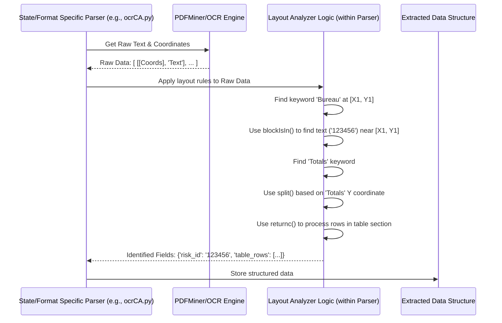

# Chapter 5: Layout Analyzer

Welcome back! In the previous chapters, we explored how the system identifies the type of PDF ([PDF Type Detector](01_pdf_type_detector_.md)), chooses the right specialist parser ([State/Format Specific Parser](02_state_format_specific_parser_.md)), and uses engines to read the raw text, either directly ([PDFMiner Parser Engine](03_pdfminer_parser_engine_.md)) or from images ([OCR Parser Engine](04_ocr_parser_engine_.md)).

So now, our specialized parser has a list of text pieces and their locations (X, Y coordinates) on the page. But how does it know *what* each piece of text means? How does it figure out that the number `12345` is the "Risk ID" and not just some random number?

## The Problem: Making Sense of Raw Text Locations

Imagine you have a filled-out paper form, but instead of seeing the form itself, you only get a list like this:

*   "Risk ID:" found at (top-right corner)
*   "12345" found slightly to the right of "Risk ID:"
*   "Effective Date:" found at (middle-left)
*   "01/01/2024" found slightly to the right of "Effective Date:"
*   "Totals" found near the bottom
*   "500" found under the "Payroll" column header, near the "Totals" line.

Just having the text and its location isn't enough. The computer needs rules to understand the *structure* of the form – where the headers are, where the data fields are relative to those headers, and how tables are organized.

## The Solution: The Layout Analyzer - Our Structure Detective

This is where the **Layout Analyzer** logic comes in. It's not a separate engine but rather the *intelligence embedded within* each [State/Format Specific Parser](02_state_format_specific_parser_.md).

Think of the Layout Analyzer as the parser's ability to **read the form's structure**, just like you would:

*   **Reading Headings:** It looks for specific keywords (like "Risk ID:", "Carrier", "Policy Period", "Totals") that act as labels or section titles.
*   **Using Coordinates:** For forms with very consistent layouts, it looks for text within precise X, Y coordinate ranges where specific data is always expected to be.
*   **Understanding Tables:** It identifies rows and columns, often by looking for header words or using the positions of text elements relative to each other. It uses visual cues like whitespace or sometimes even lines (though less common in this project).
*   **Segmenting the Page:** It breaks the page down into meaningful sections (like header, policy details table, totals section) to process them independently.

Functions like `split`, `returnc`, `segmentation`, `same`, and coordinate range checks (`blockIsIn`, `isIn`) found within the parser scripts are the tools that implement this layout analysis logic.

## Key Layout Analysis Techniques

Let's break down the common methods used by the Layout Analyzer logic:

1.  **Keyword-Based Search:**
    *   **Goal:** Find a known label or header word.
    *   **How:** Scan the text extracted by [PDFMiner Parser Engine](03_pdfminer_parser_engine_.md) or [OCR Parser Engine](04_ocr_parser_engine_.md) for specific strings (e.g., "Bureau No.", "Carrier:", "Totals").
    *   **Why:** Once a keyword is found, the parser often looks for the actual data *nearby* (e.g., immediately to the right, below, or within a certain area relative to the keyword).

2.  **Coordinate-Based Search:**
    *   **Goal:** Find data known to be in a fixed position on a specific form type.
    *   **How:** Check if a text element's X, Y coordinates fall within a predefined rectangular area (bounding box).
    *   **Why:** Very efficient for forms where the layout almost never changes. Often used by PDFMiner-based parsers.

3.  **Structural Analysis (Sections, Rows, Columns):**
    *   **Goal:** Understand the overall organization, especially for tables.
    *   **How:**
        *   **Splitting/Segmentation:** Divide the page horizontally or vertically based on keywords (like "Totals" often marking the end of a table section - see `split` in `ocrNC.py`) or visual gaps. The `segmentation` function in `pdf2Json_amit_edit.py` breaks the page into major parts.
        *   **Row Grouping:** Group text elements that appear on the same horizontal line (similar Y coordinates). The `same` function in `pdf2Json_amit_edit.py` helps group items horizontally, and `returnc` in `ocrNC.py` and `ocrCA.py` processes data row by row within a defined vertical segment.
        *   **Column Identification:** Determine which column data belongs to based on its horizontal position (X coordinate) relative to known column headers or dividing lines.

## How It Works: Connecting Text to Meaning

Let's see how a specific parser, say for a scanned California form (`ocrCA.py`), might use these techniques:

1.  **Input:** The parser receives raw words and their coordinates from the [OCR Parser Engine](04_ocr_parser_engine_.md).
    ```
    [ [[50, 700], [150, 715]], 'Bureau' ],
    [ [[160, 700], [190, 715]], 'No.' ],
    [ [[200, 700], [260, 715]], '123456' ],
    [ [[50, 650], [150, 665]], 'Effective' ],
    [ [[160, 650], [260, 665]], '01/01/2024' ],
    [ [[50, 300], [100, 315]], 'Code' ],   // Table Header
    [ [[150, 300], [250, 315]], 'Payroll' ], // Table Header
    [ [[50, 280], [100, 295]], '8810' ],    // Table Data Row 1
    [ [[150, 280], [250, 295]], '100000' ],  // Table Data Row 1
    [ [[50, 260], [100, 275]], '9012' ],    // Table Data Row 2
    [ [[150, 260], [250, 275]], '50000' ],   // Table Data Row 2
    [ [[500, 100], [550, 115]], 'Totals' ],  // Section Marker
    [ [[150, 80], [250, 95]], '150000' ],    // Totals Data
    ```
2.  **Layout Analysis (inside `ocrCA.py`):**
    *   **Keyword + Relative Position:** "Find the word 'Bureau'. Define a search area to its right. Find text ('123456') in that area. This is the Risk ID." (Uses `blockIsIn`).
    *   **Keyword + Relative Position:** "Find the word 'Effective'. Look right for a date ('01/01/2024'). This is the Effective Date."
    *   **Structure (Splitting):** "Find the word 'Totals'. Use its Y coordinate in the `split` function to define the boundary between the main data table and the totals section."
    *   **Structure (Row Processing):** "Within the table section defined by `split`, use `returnc` to process rows. For each row (identified by similar Y coordinates), find the text under the 'Code' X range ('8810') and the text under the 'Payroll' X range ('100000')."
3.  **Output:** The parser now understands the *meaning* of the text pieces and organizes them, ready for the next step ([Data Extraction & Transformation](06_data_extraction___transformation_.md)).
    ```python
    {
      'risk_id': '123456',
      'rating_effective_date': '01/01/2024',
      'table_rows': [
        {'code': '8810', 'payroll': '100000'},
        {'code': '9012', 'payroll': '50000'}
      ],
      'totals': {
        'payroll': '150000'
        # ... other totals
      }
    }
    ```

Let's visualize how the parser uses this logic:



## Code Examples: Seeing the Detective Work

The Layout Analyzer logic is woven into the specific parser scripts. Let's look at simplified examples of the techniques:

**1. Keyword + Relative Position (from `ocrCA.py`)**

```python
# (Simplified logic from ocrCA.py)
# 'LIST' contains [coordinates, word] from OCR Engine

risk_id = "Not Found"
bureau_cord = None

# Find the coordinates of the keyword "Bureau"
for coords, word in LIST:
    if "bureau" in word.lower():
        bureau_cord = coords # Found keyword location
        break

# If found, define an area to the right and search
if bureau_cord:
    # Define area relative to bureau_cord (simplified X, Y ranges)
    risk_id_area = [ [bureau_cord[0][0]+100, bureau_cord[0][1]-10], # Top-Left
                     [bureau_cord[0][0]+250, bureau_cord[3][1]+10] ] # Bottom-Right

    # Search for words inside that calculated area using blockIsIn
    for coords, word in LIST:
        if blockIsIn(coords, risk_id_area): # blockIsIn checks coordinates
             risk_id += word # Found Risk ID part
```

*   **Explanation:** This finds the location of "bureau" and then defines a search box (`risk_id_area`) relative to it. The `blockIsIn` function checks if a word's coordinates fall inside this box.

**2. Coordinate-Based Search (from `pdf_parser.py`)**

```python
# (Simplified logic from pdf_parser.py)
# 'finals' is list of [ [X, Y], 'Text', 'Font'] from PDFMiner Engine

risk_id = "Not Found"

# Iterate through text elements
for element in finals:
    x_coord = element[0][0]
    y_coord = element[0][1]
    text = element[1]

    # Check if coordinates fall within a specific box for Risk ID
    # (Example coordinates for a specific NCCI layout)
    if 480 < x_coord < 520 and 730 < y_coord < 745:
        risk_id = text.strip() # Found it based on location!
        break
```

*   **Explanation:** This code directly checks if a text element's `x_coord` and `y_coord` fall within a hardcoded range (e.g., X between 480-520, Y between 730-745) known to contain the Risk ID on that specific form.

**3. Structural Analysis - Splitting (Conceptual `split` from `ocrNC.py`)**

```python
# (Conceptual logic inspired by split in ocrNC.py)
# 'cords' = list of coordinates, 'detected_word' = list of words

secs_list = [] # To store vertical section boundaries
r, c, _ = image_shape # Get page dimensions

# Find the vertical position (Y coordinate) of the first "Totals" keyword
tots = list((x,y) for x,y in list(zip(cords,detected_word)) if "totals" in y.lower())
tots = sorted(tots ,key = lambda x : x[0][0][1]) # Sort by Y position

if tots:
    first_total_y = tots[0][0][0][1]
    # Define section 1: from top of page (e.g., Y=200) to just above "Totals"
    section1_boundary = [[0, 200], [c, first_total_y - 10]] # [[TL_X, TL_Y], [BR_X, BR_Y]]
    secs_list.append(section1_boundary)
    # Define section 2: from "Totals" line downwards
    section2_boundary = [[0, first_total_y], [c, r]]
    secs_list.append(section2_boundary)
```

*   **Explanation:** This finds the "Totals" keyword. It uses the Y-coordinate of "Totals" to define the vertical boundaries (`secs_list`) that split the page into sections (e.g., the main table area vs. the totals area).

**4. Structural Analysis - Row Processing (Conceptual `returnc` from `ocrNC.py`)**

```python
# (Conceptual logic inspired by returnc in ocrNC.py)
# 'secs_list' defines section boundaries [[X1,Y1],[X2,Y2]]
# 'cords', 'detected_word' have raw data

section_index = 0 # Process the first section (e.g., the main table)
section_bounds = secs_list[section_index]
y_start = section_bounds[0][1] # Top Y of section
y_end = section_bounds[1][1]   # Bottom Y of section

# Filter elements within the section's vertical bounds
section_elements = list(filter(lambda x: (y_start < x[0][0][1] < y_end),
                              list(map(list, zip(cords, detected_word)))))

# Sort elements by Y, then X to group rows (simplified)
section_elements.sort(key = lambda x: (x[0][0][1], x[0][0][0]))

# (Code here would iterate through sorted elements, grouping those
#  with very similar Y coordinates into logical rows 'c')
rows_in_section = [] # Stores grouped rows -> [[element1, element2], [element3,...]]

# Simplified row grouping based on Y coordinate tolerance
current_row = []
current_y = -1
y_tolerance = 15 # Pixels
for element in section_elements:
    element_y = element[0][0][1]
    if not current_row or abs(element_y - current_y) <= y_tolerance:
        current_row.append(element)
        current_y = element_y # Update row's Y anchor
    else:
        rows_in_section.append(sorted(current_row, key=lambda x: x[0][0][0])) # Sort row by X
        current_row = [element] # Start new row
        current_y = element_y
if current_row: # Add the last row
    rows_in_section.append(sorted(current_row, key=lambda x: x[0][0][0]))

# 'rows_in_section' now holds data grouped by logical rows for this section
```

*   **Explanation:** This code conceptually filters text elements belonging to a specific vertical section (defined by `y_start`, `y_end`). It then sorts these elements primarily by their Y coordinate. By iterating through the sorted list and grouping elements whose Y coordinates are very close (within `y_tolerance`), it reconstructs the logical rows of the table within that section.

These examples illustrate how the Layout Analyzer logic within each parser acts like a detective, using keywords, coordinates, and structural clues (like splitting and row grouping) to decipher the layout of the document page.

## Conclusion

The Layout Analyzer isn't a single script but the combined intelligence within the [State/Format Specific Parsers](02_state_format_specific_parser_.md). It takes the raw text and coordinates provided by the [PDFMiner Parser Engine](03_pdfminer_parser_engine_.md) or [OCR Parser Engine](04_ocr_parser_engine_.md) and makes sense of the document's structure. By using techniques like keyword searching, coordinate checking, page splitting (`split`, `segmentation`), and row/column analysis (`returnc`, `same`), it figures out where different pieces of information belong on the page.

This structured understanding is crucial. Now that the system knows *where* the data is and *what* it generally represents (e.g., this number is Payroll in this row), the next step is to actually extract that specific data value, clean it up, and put it into the final format.

**Next:** [Chapter 6: Data Extraction & Transformation](06_data_extraction___transformation_.md)

---

