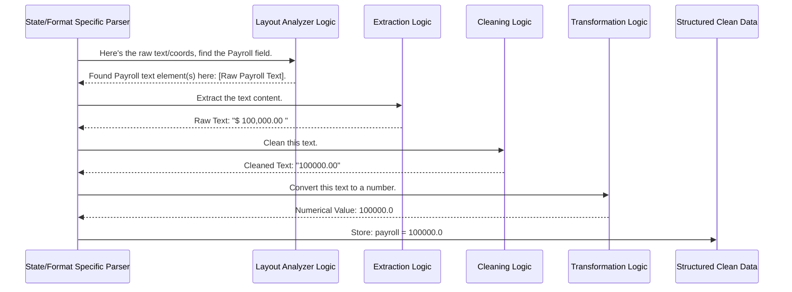

# Chapter 6: Data Extraction & Transformation

Welcome back! In the previous chapter, [Layout Analyzer](05_layout_analyzer_.md), we learned how the system acts like a detective, figuring out the structure of the PDF and identifying *where* specific pieces of information like "Risk ID" or "Payroll" are located on the page.

But just knowing *where* the answer is isn't enough. Now we need to actually read the answer, clean it up, and make sure it's in the right format for our computer system to use.

## The Problem: Raw Data is Often Messy!

Imagine the [Layout Analyzer](05_layout_analyzer_.md) tells us:
*   "The Risk ID is this text: '123 456'"
*   "The Payroll amount is this text: '$ 100,000.00'"
*   "The Effective Date is this text: '01 / 01 / 24'"
*   "The Risk Name is this text: '   ACME Corp   '"

This raw data isn't quite ready for our system.
*   The Risk ID has an extra space.
*   The Payroll has a dollar sign, a comma, and maybe extra spaces. It's also text, but we need it as a number.
*   The Date has extra spaces and uses a two-digit year, but maybe we need a four-digit year.
*   The Risk Name has extra spaces at the beginning and end.

We need a way to automatically "tidy up" this raw text and convert it into a clean, consistent format.

## The Solution: Extraction, Cleaning, and Transformation

This chapter focuses on the final steps of getting the actual data values:

1.  **Extraction:** Precisely pulling out the text identified by the [Layout Analyzer](05_layout_analyzer_.md).
2.  **Cleaning:** Removing any unwanted characters like punctuation (commas, dollar signs), extra spaces, or line breaks.
3.  **Transformation:** Converting the cleaned text into the correct data type (like turning the text "100000" into an actual number `100000`) and standardizing formats (like making sure all dates look the same).

**Analogy:** Think of this process like copying information from a handwritten form into a neat spreadsheet. You first **extract** the answer written in a specific box. Then, you **clean** it up – maybe the handwriting included a stray mark or an extra comma, so you ignore those. Finally, you **transform** it – if the form asked for a number, you write down the number `100000`, not the text "$100,000"; if it asked for a date, you might write it in a standard YYYY-MM-DD format, even if the form had MM/DD/YY.

## Key Steps in Detail

Let's break down how this happens within the [State/Format Specific Parser](02_state_format_specific_parser_.md) scripts (like `pdf_parser.py` or `ocrCA.py`):

### 1. Extraction

After the [Layout Analyzer](05_layout_analyzer_.md) logic finds the location (coordinates or relative position) of a data field, the parser script grabs the specific text element(s) associated with that location.

*   **If using PDFMiner:** It might grab the `text` content from an element found within specific coordinates.
*   **If using OCR:** It might combine words found within a specific bounding box identified relative to a keyword.

**Example (Conceptual):**

```python
# Layout Analyzer told us Risk ID is around X=500, Y=700
raw_risk_id_text = find_text_at_coords(x=500, y=700)
# raw_risk_id_text might be "123 456"
```

### 2. Cleaning

Now that we have the raw text, we need to clean it. This usually involves simple string operations:

*   **Removing extra whitespace:** Using `.strip()` to remove spaces from the beginning and end.
*   **Removing specific characters:** Using `.replace()` to remove things like `$`, `,`, or sometimes even periods if they aren't decimal points.

**Example (Conceptual Python):**

```python
raw_payroll_text = "$ 100,000.00 "

# Remove leading/trailing spaces
cleaned_text = raw_payroll_text.strip() # Result: "$ 100,000.00"

# Remove dollar sign
cleaned_text = cleaned_text.replace("$", "") # Result: " 100,000.00"

# Remove comma
cleaned_text = cleaned_text.replace(",", "") # Result: " 100000.00"

# Remove internal space (carefully!)
cleaned_text = cleaned_text.replace(" ", "") # Result: "100000.00"

print(cleaned_text) # Output: 100000.00
```
*   **Explanation:** We use basic Python string functions like `strip()` and `replace()` to get rid of unwanted characters and spaces, leaving just the essential data. The `clean()` and `cleant()` functions in scripts like `ocrCA.py` perform similar tasks.

### 3. Transformation

The final step is to convert the cleaned text into the right format and data type.

*   **Type Conversion (String to Number):** If the data represents a number (like payroll or losses), we convert the cleaned text string into a numerical type like an integer (`int`) or a floating-point number (`float`).

    ```python
    cleaned_payroll_text = "100000.00"
    payroll_value = float(cleaned_payroll_text) # Convert string to float
    # payroll_value is now the number 100000.0

    cleaned_id_text = "123456"
    risk_id_value = int(cleaned_id_text) # Convert string to integer
    # risk_id_value is now the number 123456
    ```
    *   **Explanation:** Python's `int()` and `float()` functions turn text representations of numbers into actual numbers that the computer can perform calculations with. If the text can't be converted (e.g., trying `int("hello")`), it will cause an error, so the real code often includes checks (using `try-except`) to handle cases where the data might be missing or invalid.

*   **Type Conversion (String to Date):** Dates might need to be standardized. While this project often keeps dates as strings found in the document, a more complex system might convert "01/01/24" or "Jan 1, 2024" into a standard format like "2024-01-01". (We won't dive deep into date parsing here, but be aware it's a common transformation).

*   **Handling Variations:** Sometimes data appears in slightly different ways.
    *   **Split Words:** OCR might read "Policy No." as "Policy" and "No." separately. The code might need logic to look for these parts close together and combine them.
    *   **Different Formats:** As mentioned, dates or numbers might have variations ($1,000 vs 1000.00). The cleaning steps help standardize these.
    *   **Abbreviations:** Sometimes abbreviations are used (e.g., "INJ" for injury type). The code might replace these with a standard value.

## How It Works: Inside the Parser

This extraction, cleaning, and transformation logic is tightly integrated within each [State/Format Specific Parser](02_state_format_specific_parser_.md). It happens *after* the [Layout Analyzer](05_layout_analyzer_.md) logic has pinpointed the likely location and identity of a data field.



## Code Snippets: Seeing It in Action

Let's look at simplified examples inspired by the functions used in the parsers:

**1. Basic Cleaning (inspired by `clean` in `ocrCA.py`)**

```python
import string # Import Python's string module

def simple_clean(text_to_clean):
    """Removes punctuation and leading/trailing spaces."""
    # Define punctuation to remove (can be customized)
    punctuation_to_remove = '!"$%&\'()+/:;<=>?@[\\]^_`{|}~'
    # Remove punctuation
    no_punctuation = text_to_clean.translate(str.maketrans('', '', punctuation_to_remove))
    # Remove leading/trailing spaces
    cleaned = no_punctuation.strip()
    return cleaned

# Example Usage
raw_text = "  $100,000 total! "
clean_text = simple_clean(raw_text)
print(f"Raw: '{raw_text}', Cleaned: '{clean_text}'")
# Output: Raw: '  $100,000 total! ', Cleaned: '100,000 total'
```
*   **Explanation:** This function uses `str.maketrans` to define characters to remove and `translate` to remove them. Then `strip()` removes whitespace from the ends. Note that it *doesn't* remove the comma here, which might be needed for number conversion later. The `cleant` function in `ocrCA.py` removes even more punctuation.

**2. Cleaning and Converting to Integer (Conceptual)**

```python
def get_integer_value(raw_text):
    """Cleans text for integer conversion and converts."""
    if not raw_text: # Handle empty input
        return 0
    try:
        # Remove common non-numeric chars (modify as needed)
        cleaned = raw_text.replace(",", "").replace("$", "").strip()
        # Try to convert to integer
        integer_value = int(cleaned)
        return integer_value
    except ValueError:
        # Handle cases where text is not a valid integer
        print(f"Warning: Could not convert '{raw_text}' to integer.")
        return 0 # Return a default value

# Example Usage
payroll_text = " 150,000 "
payroll_int = get_integer_value(payroll_text)
print(f"Payroll Text: '{payroll_text}', Integer Value: {payroll_int}")
# Output: Payroll Text: ' 150,000 ', Integer Value: 150000

invalid_text = "Not a number"
invalid_int = get_integer_value(invalid_text)
# Output: Warning: Could not convert 'Not a number' to integer.
print(f"Invalid Text: '{invalid_text}', Integer Value: {invalid_int}")
# Output: Invalid Text: 'Not a number', Integer Value: 0
```
*   **Explanation:** This function first cleans the string by removing commas and dollar signs. Then, it uses a `try-except` block. It *tries* to convert the cleaned string to an integer using `int()`. If it works, the integer is returned. If `int()` fails (because the text isn't a valid number), the `except ValueError` block catches the error, prints a warning, and returns a default value (0). This makes the code more robust. Similar logic is used for converting to floats using `float()`.

**3. Extracting and Combining Data (Conceptual)**

This logic is often specific to the parser and layout. For example, finding the "Risk ID" in `pdf_parser.py` involves checking coordinates:

```python
# (Simplified logic from pdf_parser.py)
# 'finals' is list of [[X, Y], 'Text', 'Font'] from PDFMiner Engine
risk_id = "Not Found"

for element in finals:
    x_coord = element[0][0]
    y_coord = element[0][1]
    text = element[1] # Raw text extracted

    # Rule: Check if coordinates fall within the Risk ID box
    if 480 < x_coord < 520 and 730 < y_coord < 745:
        # Found it! Now clean and store.
        risk_id = text.strip() # Basic cleaning (remove spaces)
        break # Stop searching once found
```
*   **Explanation:** Here, the extraction is simply taking `element[1]` once the coordinates match. The cleaning is a simple `.strip()`. Transformation isn't needed if the Risk ID is expected to be a string.

## Conclusion

Data Extraction & Transformation is the crucial step where the raw text identified by the [Layout Analyzer](05_layout_analyzer_.md) gets turned into clean, usable data. It involves:
*   **Extracting** the specific text content.
*   **Cleaning** it by removing unwanted characters and spaces.
*   **Transforming** it into the correct data type (like numbers or standard date strings) and handling variations.

This process, embedded within the logic of each [State/Format Specific Parser](02_state_format_specific_parser_.md), ensures that the final data is accurate and ready for the next stage: putting it all together in a structured output format.

**Next:** [Chapter 7: JSON Output Formatter](07_json_output_formatter_.md)

---

