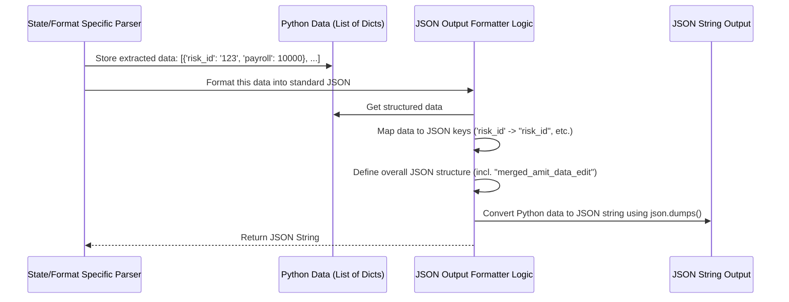

# Chapter 7: JSON Output Formatter

Welcome to the final chapter! In [Chapter 6: Data Extraction & Transformation](06_data_extraction___transformation_.md), we saw how the system pulls out the specific data values we need (like '12345' for Risk ID) and cleans them up (like removing '$' or extra spaces from '$ 100,000.00' to get '100000.00').

Now we have all these individual pieces of clean data, possibly gathered from different parts of the document or even multiple pages. But how do we package everything up neatly so that other computer systems can easily use this information?

## The Problem: Delivering Data Consistently

Imagine you've gathered all the details for a complex project – notes here, numbers there, dates on another page. Now you need to present this information to your boss or another team. You wouldn't just hand them a messy pile of notes, right? They need a clear, organized report in a format they expect.

Similarly, after our system extracts `risk_id`, `rating_effective_date`, payroll numbers, claim details, etc., it needs to present this data in a consistent, predictable way. Other software systems that use this data (maybe for analysis, storage, or display) rely on knowing *exactly* where to find each piece of information in the output. They need a standard "report template" filled out correctly every time.

## The Solution: The JSON Output Formatter - Our Report Writer

This is the final step in our PDF processing journey: the **JSON Output Formatter**. Think of it as the meticulous report writer who takes all the cleaned-up data points collected by the [State/Format Specific Parser](02_state_format_specific_parser_.md) (after the [Data Extraction & Transformation](06_data_extraction___transformation_.md) steps) and arranges them into a perfectly structured final report.

This "report" uses a format called **JSON** (JavaScript Object Notation). JSON is a very popular way for computer systems to exchange data because it's easy for both humans to read (sort of!) and machines to parse.

The JSON Output Formatter's main job is:

1.  **Assembling:** Gather all the extracted and transformed data for the entire document.
2.  **Structuring:** Organize this data into a predefined structure using specific **keys** (labels) and **nesting** (putting data inside other data categories).
3.  **Standardizing:** Ensure the output *always* follows the same format, regardless of which type of PDF was processed initially.

## Key Concepts: JSON Structure and Standardization

*   **JSON Basics:** JSON uses key-value pairs. Think of it like a dictionary or a list of labeled items. A **key** is a label (like `"risk_name"`), and a **value** is the data associated with that label (like `"ACME Corp"`). Values can be text (strings), numbers, lists (arrays), or even other JSON objects (nesting).
*   **Predefined Structure:** The `Backend-mod-api-php` project expects the output JSON to have a very specific structure. This includes top-level keys (like `"id"`, `"file_name"`) and a special key, often `"merged_amit_data_edit"`, which holds a list containing the detailed extracted data points for each relevant record found in the PDF.
*   **Consistency:** By formatting everything into this standard JSON, the system guarantees that any downstream application knows exactly how to find the `risk_id`, the `policy_no`, or the table of `payroll` and `losses` data, regardless of whether the original PDF was an NCCI form, a California form, or a scanned document processed via OCR.

## How It Works: Filling the Template

1.  **Input:** The [State/Format Specific Parser](02_state_format_specific_parser_.md) finishes its work. It has collected all the cleaned data, often storing it internally in a Python data structure like a list of dictionaries. Each dictionary might represent a row or a record from the PDF.
2.  **Mapping:** The formatting logic takes this internal Python structure and maps it to the required JSON structure. It assigns the extracted values to the predefined JSON keys.
3.  **Conversion:** It uses Python's built-in `json` library to convert the Python data structure into a JSON formatted string.
4.  **Output:** The final output is a text string containing the structured JSON data, ready to be sent back to the main PHP application or saved.

Let's visualize this final step:



## Example JSON Output Structure

Here's a *simplified* example of what the final JSON output might look like:

```json
[
  {
    "id": "", // Often filled in later by the main system
    "document_id": "", // Often filled in later
    "remote_id": "", // Often filled in later
    "file_name": "my_mod_form.pdf",
    "media_link": "", // Often filled in later
    "media_link_original": "", // Often filled in later
    "media_link_data": "", // Often filled in later
    "page_count": "3",
    "uploaded_at": "", // Often filled in later
    "processed_at": "", // Often filled in later
    "merged_amit_data_edit": [
      {
        "risk_name": "ACME Corp",
        "risk_id": "1234567",
        "rating_effective_date": "01/01/2024",
        "production_date": "12/15/2023",
        "state": "NCCI", // Or "CA", "MI", etc.
        "carrier": "Carrier ABC",
        "policy_no": "WC123456",
        "policy_no_sub": "", // Sub-policy number if applicable
        "eff_date": "01/01/2023", // Policy specific eff date
        "exp_date": "01/01/2024", // Policy specific exp date
        "code": "8810", // Class code
        "elr": "0.55", // Expected Loss Rate
        "dratio": "0.60", // D-Ratio
        "payroll": "100000", // Payroll amount (often as string)
        "expected_losses": "550",
        "exp_prim_losses": "330",
        "claim_data": "CLAIMXYZ", // Claim identifier
        "ij": "01", // Injury code
        "of": "*", // Open/Final status
        "act_inc_losses": "5000", // Actual Incurred Losses
        "act_prim_losses": "3000", // Actual Primary Losses
        "claim_abbrevation": "", // e.g., (M) for Medical Only
        "class_code_claim": "", // Class code associated with claim
        "statecode": "0-NCCI", // Internal state code
        "Policy Total": "150000", // Total Payroll for policy period
        "Subject Premium": "0", // Subject Premium
        "Total Act Inc Losses": "8000" // Total Losses for policy period
      },
      {
        // ... another record/row from the PDF ...
      }
    ]
  }
]
```

*   **Key takeaway:** Notice the consistent keys like `"risk_name"`, `"policy_no"`, `"payroll"`, and how the detailed data is nested within the `"merged_amit_data_edit"` list. This structure makes it easy for other programs to reliably access the information.

## Code Snippet: Generating the JSON

The actual JSON generation is usually straightforward using Python's `json` library. The complex part is assembling the Python dictionary (`global_list` in many parser scripts) correctly *before* this final step.

```python
import json as j # Import the json library (often aliased as j)

# Assume 'global_list' is a Python list containing a dictionary
# which holds all the extracted data, including the 'merged_amit_data_edit' list.
# This structure is built up throughout the parser script.
global_list = [
  {
    "id": "", "document_id": "", "remote_id": "",
    "file_name": "my_mod_form.pdf",
    "media_link": "", "media_link_original": "", "media_link_data": "",
    "page_count": "3",
    "uploaded_at": "", "processed_at": "",
    "merged_amit_data_edit": [
      {
        "risk_name": "ACME Corp", "risk_id": "1234567", # ... other fields ...
        "payroll": "100000", "act_inc_losses": "5000", # ... etc ...
      },
      # ... more dictionaries for other records ...
    ]
  }
]

# Define the output path for the JSON file
output_path = "output/my_mod_form.json"

# Open the output file for writing
with open(output_path, 'w') as fp:
  # Use json.dump() to write the Python data to the file as JSON
  # 'indent=4' makes the output nicely formatted and readable
  j.dump(global_list, fp, indent=4)

print(f"JSON output saved to: {output_path}")
```

*   **Explanation:** This code takes the final Python data structure (`global_list`) which contains all the information organized according to the required output keys. It then uses `j.dump()` (which stands for "dump to JSON") to convert this Python structure into a JSON formatted string and write it directly into the specified output file (`output_path`). The `indent=4` argument simply adds spacing to make the resulting JSON file easier for humans to read. This final JSON file is the ultimate output of the Python parsing process for that PDF.

This JSON formatting step is typically the very last action performed by the specific parser scripts (like `pdf_parser.py`, `ocrCA.py`, `pdf_parser_ncci2.py`, etc.) before they finish.

## Conclusion

The JSON Output Formatter is the final, crucial step that brings everything together. It takes all the data meticulously extracted, cleaned, and transformed by the previous stages ([Layout Analyzer](05_layout_analyzer_.md) and [Data Extraction & Transformation](06_data_extraction___transformation_.md)) and formats it into a standardized JSON structure.

This ensures that the output is consistent and predictable, using predefined keys like `risk_name`, `policy_no`, and the important `merged_amit_data_edit` list. This allows other parts of the `Backend-mod-api-php` system, or any other consuming application, to reliably use the extracted data.

---

This concludes our journey through the core components of the `Backend-mod-api-php` PDF processing pipeline. We started by identifying the PDF type, selecting the right parser, using engines like PDFMiner or OCR to read the text, analyzing the layout, extracting and cleaning the data, and finally, formatting it into a standard JSON output. Hopefully, this gives you a much clearer picture of how the system works!

---

