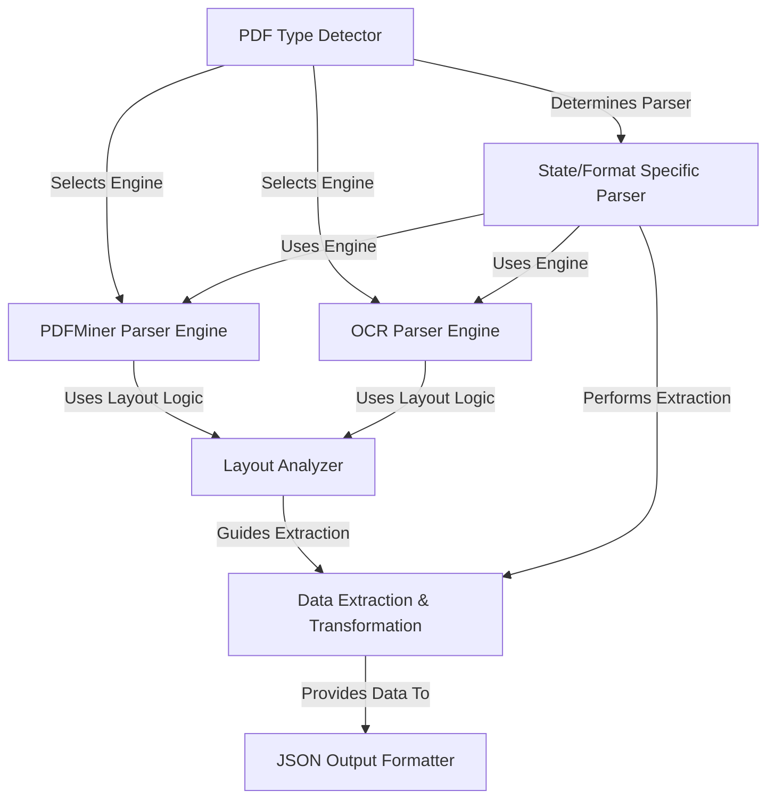

# Tutorial: Backend-mod-api-php

This project processes **PDF documents** containing insurance or financial data, often specific to different *US states* or *formats* (like NCCI, CA, MI).
It first **detects the PDF type** (text-based or scanned image).
Depending on the type, it uses either the ***pdfminer*** library to extract text directly or an ***OCR engine*** (like Google Cloud Vision) to read text from images.
It then **analyzes the layout** using coordinates and keywords to understand the document structure.
Based on the specific format, it **extracts relevant data fields** (like policy numbers, dates, amounts), cleans them up, and finally **formats the results into a standardized JSON** output.

**Source Repository:** [None](None)

## Chapters

1. [PDF Type Detector
](01_pdf_type_detector_.md)
2. [State/Format Specific Parser
](02_state_format_specific_parser_.md)
3. [PDFMiner Parser Engine
](03_pdfminer_parser_engine_.md)
4. [OCR Parser Engine
](04_ocr_parser_engine_.md)
5. [Layout Analyzer
](05_layout_analyzer_.md)
6. [Data Extraction & Transformation
](06_data_extraction___transformation_.md)
7. [JSON Output Formatter
](07_json_output_formatter_.md)

---
